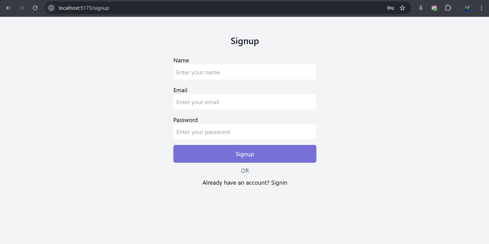

<div align="center">
    
    <h1>Second Brain</h1>
</div>

**SecondBrain** is a personal organization tool built using the MERN Stack (MongoDB, Express.js, React.js, Node.js) and TypeScript. It allows users to store, organize, and share their thoughts, links, and documents in one place. With features like user authentication, content sharing, and management, it serves as a digital "second brain" for keeping track of important information.🧠

## Features

- User can signup and login using his credentials, used authentication with jwt.
- User can add content like links, tweets, videos, to his second brain.
- User can filter content based on type in the sidebar.
- User can delete content from the second brain and can go to original link of the content.
- User can share his second brain to other users and make a unique link.
- Viewers can view the content of user shared brain in unique link.
- User can remove public link for his second brain.

## Links

- [Live Website](https://second-brain-client.vercel.app/) - Loading time may take few seconds initially (free tier).

## Preview Images

### Home Page


### Add Content Form


### Filter Content


### Shared Brain Page


### Signup Page



### Signin Page


## Tech Stack

### Frontend

Framework & Routing: `ReactJS`, `React Router`  
State Management: `Zustand`, `React Query`  
Styling: `TailwindCSS`
Notifications & Icons: `React-Toastify`, `React Icons`

### Backend

Framework & Authentication: `Node.js`, `Express.js`, `JWT`, `bcrypt`  
Validation & Documentation: `Zod`
Database & ORM: `Mongoose`

### Others

API Communication: `Axios`

## Installation and Setup

### Prerequisites

- Node.js and npm/yarn installed.
- MongoDB database set up locally or on a cloud provider.

### Steps

1. Clone the Repository

   ```bash
   git clone https://github.com/ManikMaity/Second-Brain.git
   cd Second-Brain
   ```

2. Backend Setup

   - Navigate to the backend directory:
     ```bash
     cd backend
     ```
   - Install dependencies:
     ```bash
     npm install
     ```
   - Create a `.env` file and add the following:
     `env
PORT=3000
DB_URL="mongodb url"
JWT_SECRET=""
SALT="number of salt"
CLIENT_URL="deployed frontend url"
 `
   - Start the server:
     ```bash
     npm run dev
     ```

3. Frontend Setup

   - Navigate to the frontend directory:
     ```bash
     cd frontend
     ```
   - Install dependencies:
     ```bash
     npm install
     ```
   - Update `src/configs/clientConfig.ts` file.

   ```ts
   export const BACKEND_URL: string = "";
   export const CLIENT_URL: string = "";
   ```

   - Start the development server:
     ```bash
     npm run dev
     ```

4. Access the Application
   - Open a browser and go to `http://localhost:5173`.


---

## Usage

- Navigate to the `frontend` directory and run `npm run dev` to start the development server.
- Navigate to the `backend` directory and run `npm run dev` to start the server.
- Open a browser and go to `http://localhost:5173` to access the application.
